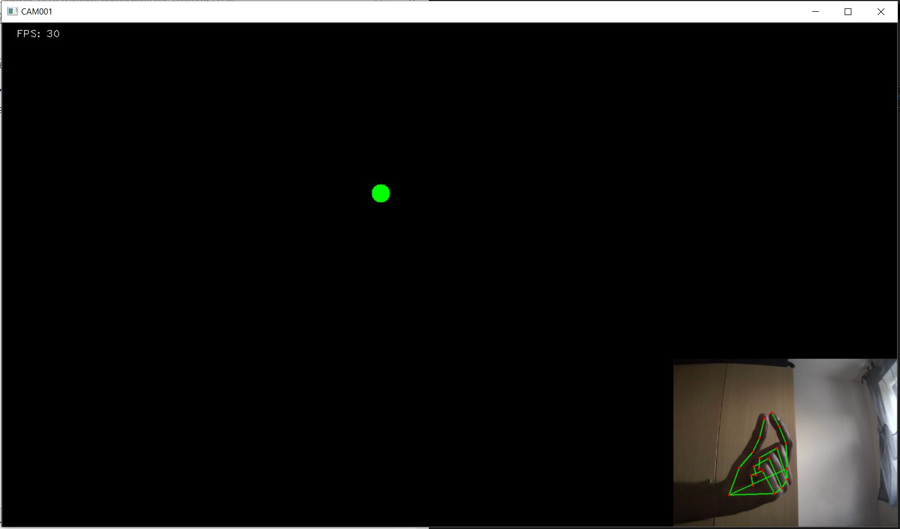

# Circle-using-Gesture-Detection
Size and position of a circle is controlled by simple hand gestures.

Using the mediapipe module to decect the hand and using the land marks detected between index finger and thumb is used to decide the position and size of the circle.

Between the below two images the size of the circle is controlled by distance between thumb and index fingers.

 

Between below two images the position of the circle is choosed by the hand gestures

  